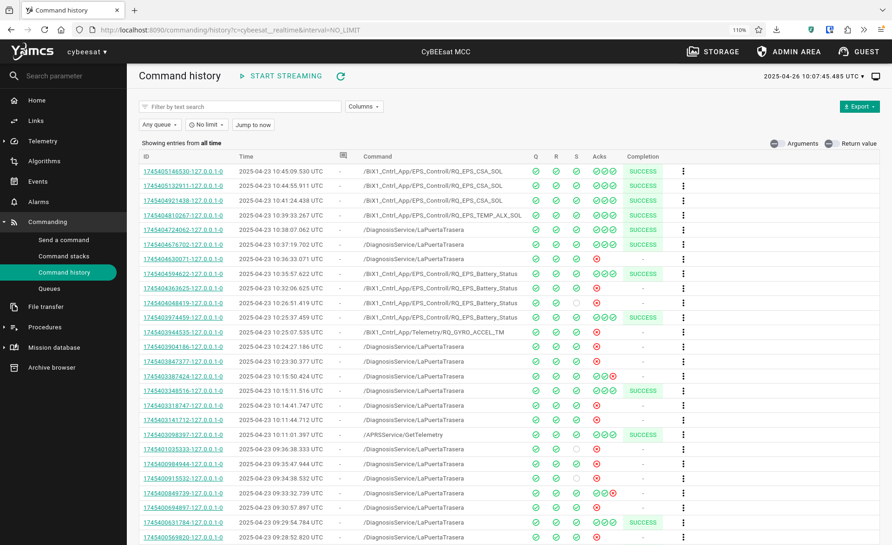
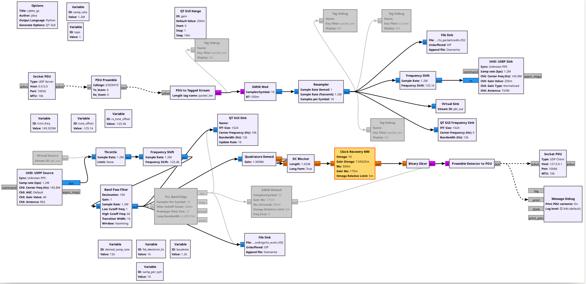

# Repository Structure

The repository is divided into the following directories:

* **`rust`**
  * The Rust applications. Includes standard applications from RCCN Userspace and CyBEEsat-specific applications.
* **`install/[usr/etc]`**
  * The directory where the application binaries, Python scripts, configuration files etc are installed into. This directory will be installed to the / directory on the OBC. Default configuration files (such as service files) are here.
* **`mcc`** 
  * The Yamcs-based ground segment used to operate the applications in this repository.
* **`gnuradio `**
  * A GNURadio-based packet transceiver for the CyBEEsat radio physical layer Requires a SDR with a TX and a RX port, and two suitable antennas.
* **`python`**
  * Contains two Python scripts: antenna_control.py and leop.py.

# `rust`

## Platform drivers

### `vcom_interface`

A minimal packet transceiver that operates the hardware radio device on CyBEEsat ("VCOM"). 
When a packet is received by the radio, the `vcom_interface` publishes it to the `radio_rx` Zenoh topic. Similarly it listens for messages on the `radio_tx` topic and transmits them to the radio.

It supports antenna diversity and best path selection (choosing the antenna that received the last transmission with the highest RSSI for the next transmissions).

Two instances of the `vcom_interface` are launched on CyBEEsat. One controls `VCOM0` and the other controls `VCOM1`. The driver supports selection of which VCOM should handle the packet for RX and TX by setting the first and second bytes of the payload (after the callsign) accordingly.

At the moment, there are many hardcoded chip initialization constants and only the transmit power can be configured. RX messages can be up to 300 bytes, TX messages can be up to 255 bytes.

The logic is in [`vcom_interface/src/radio.rs`](../rust/vcom_interface/src/radio.rs).

## `bix1_ops_app::sleep_monitor`

The sleep monitor controls the radio-based OBC keep-alive mechanism. It listens on the `radio_rx` Zenoh topic for the last received packet from either VCOM. After a configured number of seconds, it puts the OBC into ULP-1 mode (deep sleep to RAM) and lets the redundancy controller board know it is going to sleep by setting a GPIO pin low.

The OBC is woken up again by the redundancy board when either VCOM receives a packet. 

The code of the sleep monitor is at [`bix1_ops_app/src/sleep_monitor.rs`](../rust/bix1_ops_app/src/sleep_monitor.rs).

## `bix1_ops_app::battery_monitor`

The "battery monitor" thread actually does a few things:

- Generates a watchdog signal once every 5 seconds which keeps the OBC alive (monitored by the redundancy controller PCB).
- Checks that the battery voltage of either redundant battery is above 3V. Otherwise, it stops toggling the watchdog.
- Checks if a "switch OBC" telecommand has been received. If so, it stops toggling the watchdog.
- Performs a "Deadman Switch" function. This allows the operator to set a time in the future for a full reset of the satellite. (This is in addition to the deadman switch implemented in the redundancy controller PCB)

The battery monitor logic is at [`src/bix1_ops_app/src/battery_monitor.rs`](../rust/bix1_ops_app/src/battery_monitor.rs).


## `PusApp`/PUS services

These all share a similar code structure.
They contain one or more [Packet Utilisation Standard](https://ecss.nl/standard/ecss-e-st-70-41c-space-engineering-telemetry-and-telecommand-packet-utilization-15-april-2016/) services.

The structure of a user-facing PUS application is:

```
.
├── Cargo.toml
├── mdb
│   └── xyz_service.py
└── src
    ├── xyz_service
    │   ├── command.rs
    │   ├── mod.rs
    │   ├── service.rs
    │   └── telemetry.rs
    └── main.rs
```

The `mdb/xyz_service.py` file describes the PUS service `xyz` by specifying the packet format of commands and telemetry using [`yamcs-pymdb`](https://docs.yamcs.org/pymdb/). This generates an [XTCE](https://www.omg.org/xtce/) file which can be imported into the Yamcs ground segment. 

From the same `pymdb` description of the service, the `command.rs` and `telemetry.rs` modules are written/generated.
We are working on an [autogenerator](https://gitlab.com/rccn/rccn_gen) but at the moment we keep the Python file and Rust structs/enums in sync manually.

The `service.rs` module implements the command handler and manages the corresponding resource(s) for each service (e.g. a device on a serial port/I2C/SPI, a boot counter, etc.)

The `main.rs` file initializes logging etc., creates the service and starts listening on the corresponding Zenoh topic for TCs. 

Quick links for `service.rs` files of the services on `v1.0.1`:

* [`boot_app/src/boot_service/service.rs`](../rust/boot_app/src/boot_service/service.rs)
* [`aprs_app/src/aprs_service/service.rs`](../rust/aprs_app/src/aprs_service/service.rs)
  * [`aprs_app/src/aprs_service/handler.rs`](../rust/aprs_app/src/aprs_service/handler.rs)
* [`bix1_ops_app/src/controll/service.rs`](../rust/bix1_ops_app/src/controll/service.rs)
* [`bix1_ops_app/src/rtc/service.rs`](../rust/bix1_ops_app/src/rtc/service.rs)
* [`bix1_ops_app/src/telemetry/service.rs`](../rust/bix1_ops_app/src/telemetry/service.rs)
* [`deploy_app/src/deploy_service/service.rs`](../rust/deploy_app/src/deploy_service/service.rs)
* [`diagnosis_app/src/diagnosis_service/service.rs`](../rust/diagnosis_app/src/diagnosis_service/service.rs)

<!--Our student Fabian (@kienappel) is working on an  to automatically -->

# `python`

This directory contains two Python scripts:

- A basic driver written in Python for the antenna deployment mechanism. It can be used "manually" during development or via telecommand.
  - [python/antenna_control.py](../python/antenna_control.py)
- The LEOP ("Launch and Early Operations") script. It waits for a preconfigured number of seconds and calls the `antenna_control.py` script. Each axis is "deployed"/"retracted" 10 times. 
  - [python/leop.py](../python/leop.py)

# `install/[usr/etc]`

The contents of the `install/` directory are copied to the root directory (`/`) of the OBC's filesystem. (This can be done by manually copying the files, or directly "baking" them into the image using OSTree/Yocto. Documentation about this is pending.)

The applications and Python scripts are built and copied into `install/usr/bin/` by the Makefile.

However, some files are already pre-placed in `install/`. These are:

- Zenoh configuration for all nodes, RCCN COMM and FEC:
    - [install/usr/etc/rccn_zenoh_config.json5](../install/usr/etc/rccn_zenoh_config.json5)
    - [install/usr/etc/rccn_comm.yaml](../install/usr/etc/rccn_comm.yaml)
    - [install/usr/etc/rccn_fec.yaml](../install/usr/etc/rccn_comm.yaml)
- A SysV-style init script that configures the network interfaces and launches `rccn_usr_launch`:
    - [install/usr/etc/init.d/rccn_usr_launch](../install/usr/etc/init.d/rccn_usr_launch)
- Configuration files for `rccn_usr_launch`. These services are started/monitored at boot. Services are configured using the [Horust service](https://gh.fponzi.me/Horust/#service-configuration) syntax.
    - Default configuration for all services:
        - [install/usr/etc/rccn_services/default.toml](../install/usr/etc/rccn_services/default.toml)
    - The rest of the services (most are a two-line configuration file specifying the name and start command for the service)
        - [install/usr/etc/rccn_services](../install/usr/etc/rccn_services/)

# `mcc`

This contains the Yamcs-based operator user interface ("Mission Control Center").



We are working on writing documentation for how to use it. In the meantime, we'll leave links to the important files:

- CyBEEsat instance configuration file. Includes port numbers, CCSDS frame types, relevant MDB files and Yamcs services.
  - [mcc/src/main/yamcs/etc/yamcs.cybeesat.yaml](../mcc/src/main/yamcs/etc/yamcs.cybeesat.yaml)
- MDB ("Mission Database") XTCE/XML files (autogenerated by `pymdb` scripts in the `rust` directory)
  - [mcc/src/main/yamcs/mdb/aprs-app.xml](../mcc/src/main/yamcs/mdb/aprs-app.xml)
  - [mcc/src/main/yamcs/mdb/bix1_tmtc.xml](../mcc/src/main/yamcs/mdb/bix1_tmtc.xml)
  - [mcc/src/main/yamcs/mdb/boot-app.xml](../mcc/src/main/yamcs/mdb/boot-app.xml)
  - [mcc/src/main/yamcs/mdb/deploy-app.xml](../mcc/src/main/yamcs/mdb/deploy-app.xml)
  - [mcc/src/main/yamcs/mdb/diagnosis-app.xml](../mcc/src/main/yamcs/mdb/diagnosis-app.xml)
- "Base" MDB files, defining CCSDS Space Packet / PUS TC/TM headers / base data types
  - [mcc/src/main/yamcs/mdb/ccsds-pus.xml](../mcc/src/main/yamcs/mdb/ccsds-pus.xml)
  - [mcc/src/main/yamcs/mdb/dt.xml](../mcc/src/main/yamcs/mdb/dt.xml)

# `gnuradio`



This directory contains a GNURadio based packet transceiver ("Terminal Node Controller", TNC) that transmits the same air frame that is expected by the CyBEEsat's hardware radio and decodes transmissions from CyBEEsat.

It receives data to be transmitted on UDP port 10066 and sends received packets from CyBEEsat to UDP port 10056. Yamcs is also using these ports.

This GNURadio flow chart uses two embedded Python modules ("PDU Preamble") and ("Preamble Detector to PDU").

This GNURadio-based transceiver "barely works". Packets are sometimes missed and the performance is not optimized.

